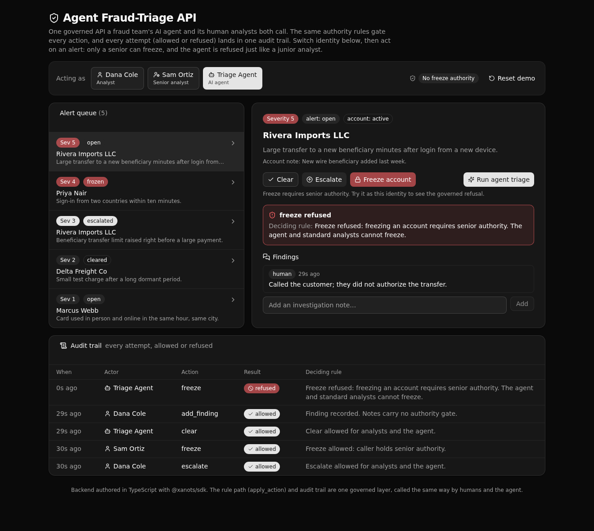

# Agent Fraud-Triage API

One governed Xano API a fraud team's AI agent and its human analysts both call, with the same authority rules on every action and one audit trail of every attempt.

**5 tables · 8 APIs · 2 functions · 1 agent** · Play 4 (Agent Intelligence Layer) · financial services / fraud operations



## What it demonstrates

This is a proof artifact for Xano's **Agent Intelligence Layer** play. An AI agent and human analysts hit the *same* permissioned, logged endpoints, so the business rules live in one place a technical evaluator can read and trust.

The point an evaluator cares about: an agent gets no privileged shortcut. When the Triage Agent asks to freeze an account, the API refuses it at the rule layer with the deciding rule, exactly as it refuses a standard analyst. A senior analyst is allowed. Every attempt, allowed or refused, is written to one audit trail with the actor, the action, and the rule.

Two design choices make that concrete:

- **One shared rule path.** Both `alerts/act` (used by humans and the agent) and `triage/run` (the agent showcase) call the same `apply_action` function. A human and the agent cannot drift apart, because there is only one path.
- **The agent's output is constrained.** `fraud_triage_agent` can only return `clear` or `escalate`. Freezing is off its menu, and it is also refused at the rule layer if it tries `alerts/act` with `freeze`. Defense in two places, not one.

Authorization is at the API layer (role-based access control with per-endpoint guards), which is how Xano works. There is no row-level security here.

## Repo layout

```
xano/
├── index.ts                  the workspace, registering everything below
├── tables/                   analysts (auth), accounts, alerts, findings, agent_actions (audit)
├── api/
│   ├── groups.ts             the six API groups (pinned canonical slugs)
│   ├── seed_reset.ts         POST seed/reset  - reset + seed the demo
│   ├── auth_token.ts         POST auth/token  - password check, mint a token
│   ├── alerts_queue.ts       GET  alerts/queue
│   ├── alerts_get.ts         GET  alerts/get/{alert_id}
│   ├── alerts_act.ts         POST alerts/act  - clear / escalate / freeze
│   ├── triage_run.ts         POST triage/run  - the agent showcase
│   ├── findings_add.ts       POST findings/add
│   └── actions_list.ts       GET  actions/list - the audit trail
├── functions/
│   ├── load_actor.ts         resolve + classify the caller (human vs agent, freeze authority)
│   └── apply_action.ts       the ONE shared rule path: gate, apply, always audit
├── agents/
│   └── fraud_triage_agent.ts the triage agent (xano-free, output constrained to clear/escalate)
└── seed/fixtures.ts          demo analysts, accounts, and alerts
frontend/                     React + Vite + Tailwind + shadcn/ui (dark), derives its
                              paths and types from the query defs (frontend/src/lib/api.ts)
```

## API surface

| Verb | Path | What it enforces |
| ---- | ---- | ---- |
| POST | `api:aftq-seed/reset` | Public. Resets and seeds analysts, accounts, and open alerts. |
| POST | `api:aftq-auth/token` | Real password check, then mints a token. Returns the classified actor. |
| GET  | `api:aftq-alerts/queue` | Auth required. The alert queue joined with its account. |
| GET  | `api:aftq-alerts/get/{alert_id}` | Auth required. One alert with its account and findings. |
| POST | `api:aftq-alerts/act` | Auth required. Clear, escalate, or freeze through the shared rule path. Freeze needs senior authority. |
| POST | `api:aftq-triage/run` | Agent token only. Runs the agent, applies the result through the same rule path, audited as the agent. |
| POST | `api:aftq-findings/add` | Auth required. Appends a note, tagged human or agent, and logs it. |
| GET  | `api:aftq-actions/list` | Auth required. The audit trail, newest first, with an optional `alert_id` filter. |

## Quick start

You need Node 20.19+ and a Xano account.

```bash
git clone https://github.com/xano-scratch/agent-fraud-triage-api.git
cd agent-fraud-triage-api
npm install
npx xanots login          # one-time browser auth with your Xano instance
npm run xano:deploy       # builds the frontend, deploys backend + frontend, prints a live URL
```

Open the printed frontend URL. It seeds demo data on first load and logs you in as an analyst. Switch identity in the actor bar, pick an alert, and act on it. Try Freeze as the agent or a standard analyst to see the governed refusal, then switch to the senior analyst and watch it go through. The audit trail at the bottom records every attempt.

The three demo logins share the password `fraudops-demo`: `dana@fraudops.example` (analyst), `sam@fraudops.example` (senior), `triage-agent@fraudops.example` (the agent). These are demo fixtures, not secrets.

## How the frontend stays in sync

`frontend/src/lib/api.ts` is the one contract. It derives request paths with `getPath()` and request/response types with `InferInput` / `InferResponse` straight from the query defs. Change an endpoint and the frontend types follow, so a drift shows up as a type error at build time rather than a broken call at runtime.

## xano.lock

`xano/xano.lock` pins every object's identity and its public URL. Commit it. A later rename stays a rename instead of a delete and recreate, and the public paths stay stable.

## FAQ

**Does the agent need a model API key?** No. The agent uses the `xano-free` provider, so the demo runs with no external credentials. The triage endpoint treats the agent's decision as enrichment over a deterministic severity rule, so it stays well behaved even when the free model is busy.

**Where are the authority rules?** In `xano/functions/apply_action.ts`. That one function decides whether an action is allowed, records the deciding rule, applies the state change when allowed, and writes the audit row every time.

**Is this row-level security?** No. Access is controlled at the API layer with role checks per endpoint. That is how Xano models authorization.

**Can I adapt it?** Yes. Change the tables and the rules in `apply_action`, keep the shared-path-plus-audit shape, and you have a governed API your own agents and people can share.
